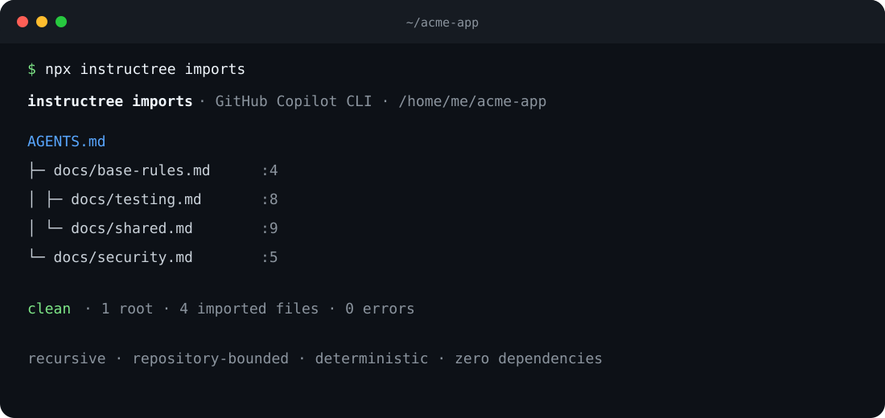

<div align="center">

# Instructree

**Find the instructions your AI coding agent will actually use.**

Map and lint `AGENTS.md`, `CLAUDE.md`, Copilot instructions, agent skills, and agentic workflows—locally, with zero runtime dependencies.

[](https://github.com/kotobuki09/instructree/actions/workflows/ci.yml)
[](LICENSE)
[](https://nodejs.org/)

</div>



Coding agents now read instructions from several files with different scopes. One stale nested rule can quietly fight the repository rule. Instructree gives you the map before the agent gets the prompt.

## Try it

No install or API key:

```bash
npx --yes github:kotobuki09/instructree
```

Ask what may apply to one file:

```bash
npx --yes github:kotobuki09/instructree explain src/api/client.ts
```

Install from GitHub if you want the command everywhere:

```bash
npm install --global github:kotobuki09/instructree
instructree
```

## What it catches

- malformed or incomplete frontmatter in skills, custom agents, and agentic workflows;
- duplicate skill names across `.agents`, `.claude`, and `.github`;
- skill names that do not use portable kebab-case or match their folder;
- broken relative Markdown links inside agent instruction files;
- instruction files that are manual-only because they have no path glob;
- likely `always`/`never` conflicts in overlapping scopes, clearly labeled as heuristic.

It prints stable file-and-line diagnostics and exits nonzero for schema errors, so the default is safe for CI. Add `--strict` to fail on warnings too.

## Supported formats

| Surface | Files discovered | Path explanation |
| --- | --- | --- |
| Cross-agent | `AGENTS.md` at any depth | Directory scope |
| Claude | `CLAUDE.md`, `CLAUDE.local.md`, `.claude/rules/*.md` | Directory scope or `paths` |
| GitHub Copilot | `.github/copilot-instructions.md`, `*.instructions.md` | Repository scope or `applyTo` |
| Agent Skills | `.agents/skills/*/SKILL.md`, `.claude/skills/*/SKILL.md`, `.github/skills/*/SKILL.md` | Listed as on demand |
| Custom agents | `.github/agents/*.agent.md` | Listed as on demand |
| Agentic Workflows | `.github/workflows/*.md` | Metadata validation |
| Other agents | `GEMINI.md`, `.cursor/rules/*.mdc`, `.windsurf/rules/*.md` | Directory scope or `globs` |

The formats are grounded in the current [VS Code custom-instructions documentation](https://github.com/microsoft/vscode-docs/blob/main/docs/agent-customization/custom-instructions.md), [GitHub customization matrix](https://docs.github.com/en/copilot/reference/customization-cheat-sheet), and [Agent Skills documentation](https://docs.github.com/en/copilot/concepts/agents/about-agent-skills).

## Commands

```text
instructree [scan] [root] [--json] [--strict]
instructree explain <file> [--root <root>] [--json]
instructree --help | --version
```

Examples:

```bash
# Scan this repository
instructree

# Scan a different checkout and fail on warnings
instructree ../my-monorepo --strict

# Feed diagnostics to another tool
instructree --json > instructree-report.json

# See the broad-to-specific instruction map for a target
instructree explain packages/api/src/routes.ts
```

Exit codes are `0` for a passing policy, `1` for diagnostics that fail the selected policy, and `2` for invalid arguments or runtime errors.

## CI

```yaml
name: instruction-lint
on: [pull_request]

jobs:
  instructree:
    runs-on: ubuntu-latest
    steps:
      - uses: actions/checkout@v4
      - uses: actions/setup-node@v4
        with:
          node-version: 22
      - run: npx --yes github:kotobuki09/instructree --strict
```

## Design boundaries

Instructree is static analysis. It does not call a model, upload repository content, or claim to predict agent behavior. Discovery and precedence differ between clients and versions, so `explain` says what *may* apply and shows each format separately. Conflict detection is intentionally conservative and reported as a warning for human review.

See [CONTRIBUTING.md](CONTRIBUTING.md) for the small, dependency-free development loop. If Instructree misses a real instruction format, [open an issue](https://github.com/kotobuki09/instructree/issues/new/choose) with a minimal example.
